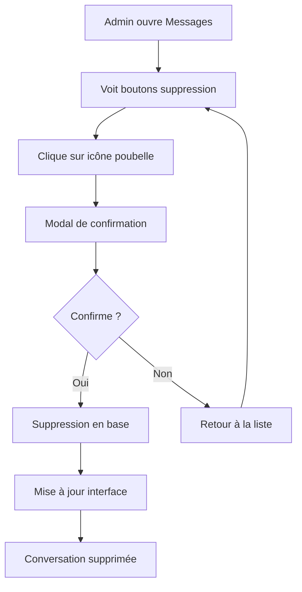

# 🗑️ Guide : Suppression de Conversations par les Administrateurs

## ✅ Fonctionnalité Implémentée

La fonctionnalité de suppression de conversations pour les administrateurs a été implémentée avec succès. Les administrateurs peuvent maintenant supprimer des conversations directes et de groupe depuis la page Messages.

## 🎯 Fonctionnement

### **Qui peut supprimer des conversations ?**
- ✅ **Administrateurs uniquement** (`user.role === 'admin'` ou `user.email === 'admin@aphs.com'`)
- ❌ **Utilisateurs normaux** ne voient pas les boutons de suppression
- ❌ **Intervenants** ne peuvent pas supprimer les conversations

### **Quelles conversations peuvent être supprimées ?**
- ✅ **Conversations directes** (1:1 entre utilisateurs)
- ✅ **Conversations de groupe** (créées manuellement)
- ❌ **Conversations workgroup** (discussions automatiques) - **PROTÉGÉES**

### **Processus de suppression**
1. **Bouton visible** : Icône poubelle rouge à côté de chaque conversation éligible
2. **Confirmation obligatoire** : Modal avec détails de la conversation
3. **Suppression définitive** : Tous les messages et participants sont supprimés
4. **Mise à jour automatique** : La liste se rafraîchit immédiatement

## 🔧 Implémentation Technique

### **Base de données**
```sql
-- Nouvelle fonction SQL
CREATE OR REPLACE FUNCTION admin_delete_conversation(
    p_conversation_id UUID,
    p_user_id UUID
)
RETURNS BOOLEAN

-- Vérifications de sécurité :
- Vérification du rôle admin
- Protection des conversations workgroup
- Suppression en cascade (messages, participants, lectures)
```

### **Frontend**
```typescript
// Hook étendu
const { deleteConversation } = useMessages();

// Vérification admin
const isAdmin = user?.user_metadata?.role === 'admin' || 
               user?.email === 'admin@aphs.com';

// Bouton de suppression
{isAdmin && conv.type !== 'workgroup' && (
  <Button onClick={() => handleDeleteConversation(conv)}>
    <Trash2 className="h-3 w-3" />
  </Button>
)}
```

### **Traductions**
Support multilingue complet :
- 🇫🇷 **Français** : "Supprimer la conversation"
- 🇬🇧 **Anglais** : "Delete Conversation"
- 🇪🇸 **Espagnol** : "Eliminar Conversación"
- 🇸🇦 **Arabe** : "حذف المحادثة"

## 🛡️ Sécurité et Protections

### **Vérifications côté serveur**
```sql
-- Vérification admin obligatoire
IF NOT EXISTS(SELECT 1 FROM profiles WHERE user_id = p_user_id AND role = 'admin')
THEN RAISE EXCEPTION 'Accès refusé: seuls les administrateurs peuvent supprimer';

-- Protection des conversations workgroup
IF conversation_type = 'workgroup' 
THEN RAISE EXCEPTION 'Impossible de supprimer une conversation de workgroup';
```

### **Vérifications côté client**
- Boutons visibles uniquement aux admins
- Conversations workgroup exclues automatiquement
- Confirmation obligatoire avant suppression

## 🎨 Interface Utilisateur

### **Bouton de suppression**
- **Position** : À côté du timestamp de chaque conversation
- **Apparence** : Icône poubelle rouge discrète
- **Comportement** : Survol révèle l'action
- **Tooltip** : Texte explicatif selon la langue

### **Modal de confirmation**
- **Titre** : "Supprimer la conversation" (traduit)
- **Contenu** : Avertissement sur la suppression définitive
- **Aperçu** : Nom et type de la conversation
- **Actions** : Bouton rouge "Supprimer" + bouton "Annuler"

## 📋 Utilisation

### **Étape 1 : Accès admin**
1. Se connecter en tant qu'administrateur
2. Aller dans la page "Messages"
3. Les boutons de suppression sont visibles

### **Étape 2 : Supprimer une conversation**
1. Cliquer sur l'icône poubelle rouge
2. Confirmer dans la modal qui s'ouvre
3. La conversation disparaît immédiatement

### **Étape 3 : Vérification**
- La conversation n'apparaît plus dans la liste
- Si c'était la conversation active, elle se ferme
- Tous les messages sont définitivement supprimés

## ⚠️ Limitations et Règles

### **Conversations protégées**
- ❌ **Conversations workgroup** : Impossibles à supprimer
- ✅ **Conversations directes** : Supprimables par les admins
- ✅ **Conversations de groupe** : Supprimables par les admins

### **Permissions**
- Seuls les vrais administrateurs peuvent supprimer
- Vérification en base de données obligatoire
- Pas de suppression en lot (une par une)

## 🔄 Workflow Admin



## 📊 Statistiques Admin

Une fonction bonus est disponible pour les statistiques :
```sql
-- Obtenir des stats sur les conversations
SELECT * FROM admin_get_conversation_stats(user_id);
```

## 🚀 Déploiement

### **1. Base de données**
```sql
-- Exécuter le script SQL dans Supabase
-- Fichier: admin_delete_conversations.sql
```

### **2. Frontend**
```bash
# Les modifications sont déjà intégrées
npm run build
```

### **3. Vérifications**
- [x] Fonction SQL créée
- [x] Hook étendu
- [x] Interface mise à jour
- [x] Traductions ajoutées
- [x] Sécurité vérifiée

## 📝 Notes Importantes

1. **Suppression définitive** : Aucune récupération possible
2. **Conversations workgroup** : Protégées par design
3. **Permissions strictes** : Admins uniquement
4. **Multilingue** : Support complet des 4 langues
5. **Sécurité** : Vérifications côté client ET serveur

## 🎉 Résultat

Les administrateurs peuvent maintenant :
- 🗑️ **Supprimer** des conversations directes et de groupe
- 🛡️ **Protéger** les conversations workgroup automatiques
- 🌍 **Utiliser** l'interface dans leur langue préférée
- ⚡ **Voir** les changements instantanément
- 🔒 **Bénéficier** de protections de sécurité robustes 