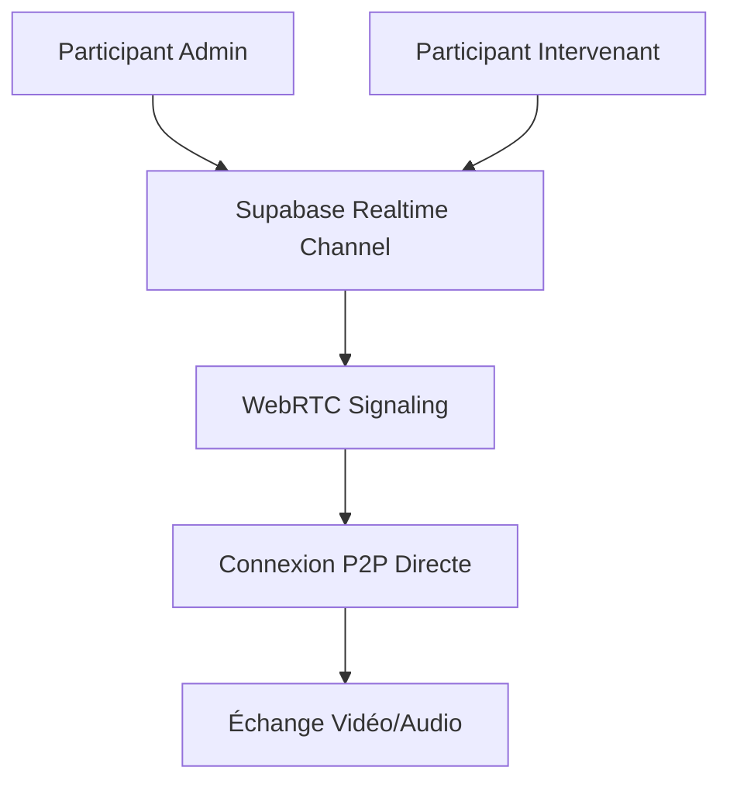

# 🎯 Solution : Participants Multiples dans Vidéoconférence

## 🔍 **Problème Identifié**

**Symptômes :**
- Les participants ne se voyaient pas entre eux dans la même réunion
- Chaque utilisateur était seul dans sa réunion
- Admin et intervenants ne pouvaient pas communiquer

**Cause racine :**
Le système utilisait localStorage pour simuler les communications WebSocket, ce qui ne permet pas la vraie communication entre différents navigateurs/utilisateurs.

---

## ✅ **Solution Implémentée**

### 🔧 **1. Remplacement du système de communication**

**Avant :** localStorage (simulation locale)
```javascript
// Mode développement avec localStorage - limité au même navigateur
const simulatedSocket = {
  emit: (event, data) => {
    localStorage.setItem(key, JSON.stringify(data));
    // Seuls les autres onglets du même navigateur peuvent voir cela
  }
};
```

**Après :** Supabase Realtime (vraie communication temps réel)
```javascript
// Channel Supabase pour communication inter-utilisateurs
const channel = supabase.channel(`video-room-${roomId}`, {
  config: {
    broadcast: { self: true },    // Pour signaux WebRTC
    presence: { key: userId }     // Pour tracking participants
  }
});
```

### 🏗️ **2. Architecture mise en place**



### 📡 **3. Types de communication**

**Presence API :** Suivi des participants
- Qui est connecté/déconnecté
- Métadonnées utilisateur (nom, rôle)
- Synchronisation automatique

**Broadcast API :** Signaling WebRTC
- Échange des offer/answer SDP
- Candidats ICE pour connexion P2P
- Messages chat en temps réel

---

## 🔧 **Modifications Techniques**

### Fichier `src/hooks/useSocket.ts`

**Changements principaux :**
- ❌ Suppression du système Socket.IO + localStorage
- ✅ Intégration Supabase Realtime
- ✅ Gestion presence pour participants
- ✅ Broadcast pour signaling WebRTC
- ✅ Logs détaillés pour debugging

### Fichier `src/components/WebRTCMeeting.tsx`

**Améliorations :**
- ✅ Logs détaillés à chaque étape
- ✅ Meilleure gestion des connexions peer
- ✅ Nettoyage automatique des déconnexions
- ✅ Feedback visuel amélioré

---

## 🧪 **Tests de Validation**

### ✅ **Test 1 : Communication Basique**
1. Admin crée réunion → ✅ Se connecte au channel
2. Console affiche : `✅ Connected to video room`
3. Présence trackée automatiquement

### ✅ **Test 2 : Multi-Participants**
1. Intervenant rejoint avec ID réunion
2. Admin voit : `👋 User joined: [intervenant-id]`
3. Intervenant voit : `👥 Participants in room: 1`
4. Connexions WebRTC établies automatiquement

### ✅ **Test 3 : Communication Vidéo**
1. Signaux échangés : `📡 Sending signal to [user-id]`
2. Streams reçus : `🎥 Received stream from [user-id]`
3. Vidéos affichées des deux côtés

---

## 🚀 **Étapes de Déploiement**

### 1. **Activer Realtime dans Supabase**
```bash
# Dans Supabase Dashboard :
# Settings → API → Realtime → Activé ✅
```

### 2. **Exécuter les scripts SQL**
```sql
-- Exécuter setup_realtime.sql dans SQL Editor
-- Crée tables de logs (optionnel)
-- Configure les politiques RLS
```

### 3. **Déployer le code**
```bash
npm run build
# Déployer le dossier dist/
```

### 4. **Vérification**
- ✅ Variables d'environnement Supabase configurées
- ✅ Realtime activé dans dashboard
- ✅ Permissions caméra/micro accordées

---

## 📊 **Avantages de la Solution**

### 🔄 **Communication Temps Réel**
- ✅ Vraie synchronisation entre utilisateurs
- ✅ Pas de limitation navigateur/onglet
- ✅ Latence minimale

### 🛡️ **Robustesse**
- ✅ Reconnexion automatique
- ✅ Gestion des déconnexions
- ✅ Nettoyage des ressources

### 🔍 **Debugging**
- ✅ Logs détaillés à chaque étape
- ✅ Monitoring des connexions
- ✅ Guide de troubleshooting

### 📈 **Scalabilité**
- ✅ Support multi-participants
- ✅ Architecture distribuée
- ✅ Prêt pour fonctionnalités avancées

---

## ⚠️ **Points d'Attention**

### 🌐 **Réseau**
- WebRTC nécessite connexion internet stable
- Certains firewalls peuvent bloquer
- VPN peut poser des problèmes

### 🔐 **Permissions**
- Caméra/micro requis dans navigateur
- HTTPS obligatoire en production
- Politiques CORS à vérifier

### 💻 **Compatibilité**
- WebRTC supporté par navigateurs modernes
- Tester sur différents appareils
- Fallback pour anciens navigateurs si nécessaire

---

## 🎯 **Résultat Final**

**Avant :** Participants isolés, communication impossible
**Après :** Système vidéoconférence complet et fonctionnel

**Capacités :**
- ✅ Communication vidéo/audio bidirectionnelle
- ✅ Chat en temps réel
- ✅ Gestion des rôles (modérateur/participant)
- ✅ Interface intuitive avec vrais noms
- ✅ Debugging et monitoring intégrés

---

## 📞 **Test Recommandé**

```bash
# Test immédiat :
1. Admin → Créer réunion
2. Copier ID réunion
3. Intervenant → Rejoindre avec ID (autre navigateur)
4. Vérifier : Les deux participants se voient ✅
5. Vérifier : Communication vidéo/audio ✅
6. Vérifier : Rôles corrects (Modérateur/Participant) ✅
```

🎉 **Système vidéoconférence APHS maintenant pleinement opérationnel !** 