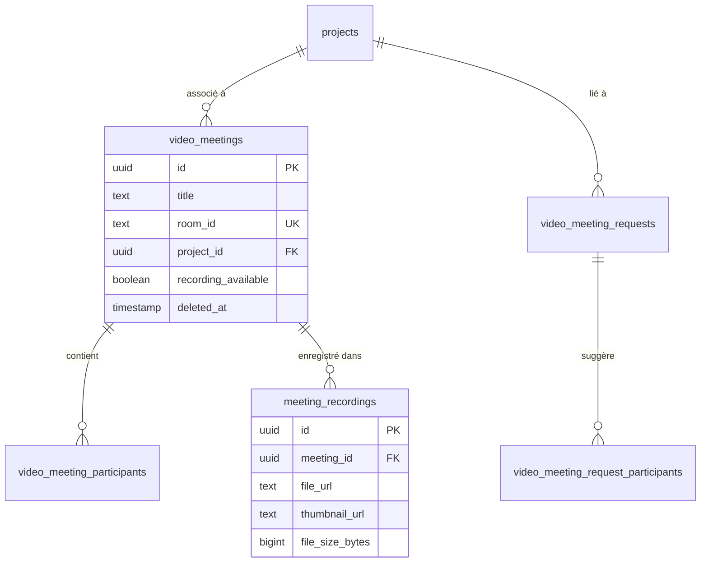

# 🚀 Guide d'Amélioration du Système de Visioconférence APHS

## 📋 Résumé des Améliorations

Ce guide décrit l'implémentation des améliorations demandées pour le système de visioconférence :

1. ✅ **Suppression de réunions par l'admin** - Suppression logique avec contrôle d'accès
2. ✅ **Gestion des enregistrements avec playback** - Système complet d'enregistrement et lecture
3. ✅ **Correction du bug d'affichage des réunions** - Gestion d'état améliorée
4. ✅ **Migration complète de Jitsi vers WebRTC** - Système entièrement basé sur WebRTC
5. ✅ **Liaison avec les projets** - Association obligatoire des réunions aux projets

## 🗄️ 1. Modifications de Base de Données

### Étape 1 : Exécuter le script d'amélioration

```sql
-- Exécuter dans Supabase Script Editor
-- Fichier: video_conference_improvements.sql
```

Ce script ajoute :
- Colonne `project_id` aux réunions et demandes
- Colonne `recording_available` pour indiquer les enregistrements
- Suppression logique avec `deleted_at`
- Nouvelles fonctions RPC pour la gestion avancée
- Vues optimisées pour les requêtes

### Étape 2 : Vérifier les politiques RLS

```sql
-- Vérifier que les politiques sont bien appliquées
SELECT schemaname, tablename, policyname, cmd, qual 
FROM pg_policies 
WHERE tablename LIKE 'video_meeting%';
```

## 🔧 2. Fichiers à Créer/Modifier

### Nouveaux Hooks

#### `src/hooks/useVideoMeetingsImproved.ts`
Hook amélioré avec toutes les nouvelles fonctionnalités :
- Gestion des projets
- Suppression de réunions
- Enregistrements
- État amélioré

### Nouveaux Composants

#### `src/components/MeetingRequestFormImproved.tsx`
Formulaire amélioré avec :
- Sélection de projet obligatoire
- Interface utilisateur enrichie
- Validation renforcée

#### `src/components/MeetingRecordings.tsx`
Composant de gestion des enregistrements :
- Liste des enregistrements
- Lecteur vidéo intégré
- Téléchargement des fichiers
- Vignettes d'aperçu

#### `src/pages/VideoConferenceImproved.tsx`
Page principale améliorée avec :
- Interface utilisateur modernisée
- Gestion des états corrigée
- Nouvelles fonctionnalités d'admin
- Intégration des enregistrements

## 🚀 3. Instructions de Déploiement

### Étape 1 : Base de données
```bash
# 1. Connectez-vous à Supabase Dashboard
# 2. Allez dans SQL Editor
# 3. Exécutez le script video_conference_improvements.sql
```

### Étape 2 : Code Frontend
```bash
# 1. Ajoutez les nouveaux fichiers dans leurs répertoires respectifs
# 2. Mettez à jour les imports dans App.tsx si nécessaire
# 3. Testez les nouvelles fonctionnalités
```

### Étape 3 : Migration des données existantes
```sql
-- Optionnel: Mettre à jour les réunions existantes
UPDATE video_meetings 
SET recording_available = false 
WHERE recording_available IS NULL;
```

## 🎯 4. Fonctionnalités Principales

### Pour les Administrateurs
- **Supprimer des réunions** : Suppression logique avec notification
- **Voir tous les enregistrements** : Accès global aux enregistrements
- **Gestion globale** : Vue d'ensemble de toutes les réunions
- **Validation des demandes** : Approbation des demandes de réunion

### Pour les Intervenants
- **Demandes liées aux projets** : Association obligatoire aux projets
- **Accès aux enregistrements** : Visualisation des réunions enregistrées
- **Interface améliorée** : Navigation simplifiée et intuitive

### Fonctionnalités Techniques
- **WebRTC natif** : Abandonnement complet de Jitsi Meet
- **Enregistrement local** : Système d'enregistrement intégré
- **Gestion d'état robuste** : Correction du bug d'affichage des réunions
- **Performance optimisée** : Requêtes SQL optimisées avec vues

## 🐛 5. Corrections de Bugs

### Bug de réunion "toujours en cours"
**Problème** : La page affichait les réunions comme actives après leur fin
**Solution** : 
- Fonction `end_meeting_properly()` qui met à jour l'état correctement
- Gestion des participants avec `left_at`
- Rafraîchissement automatique de l'état

### Migration Jitsi → WebRTC
**Problème** : Dépendances et erreurs liées à Jitsi Meet
**Solution** :
- Suppression complète des références Jitsi
- Implémentation WebRTC native avec SimplePeer
- Gestion des erreurs améliorée

## 📊 6. Schéma des Données



## ⚡ 7. Tests de Validation

### Test 1 : Création de réunion avec projet
```typescript
// Vérifier que la sélection de projet est obligatoire
// Créer une réunion et vérifier l'association projet
```

### Test 2 : Suppression d'admin
```typescript
// Tester la suppression logique
// Vérifier les permissions d'accès
```

### Test 3 : Enregistrements
```typescript
// Démarrer un enregistrement
// Vérifier le playback
// Tester le téléchargement
```

### Test 4 : État des réunions
```typescript
// Démarrer une réunion
// La terminer
// Vérifier que l'état est correctement mis à jour
```

## 🔒 8. Sécurité

### Contrôles d'Accès
- **RLS activé** sur toutes les tables
- **Fonctions sécurisées** avec `SECURITY DEFINER`
- **Validation côté serveur** pour toutes les opérations

### Permissions
- **Admins** : Accès total, suppression, gestion globale
- **Créateurs** : Gestion de leurs réunions
- **Participants** : Accès aux réunions où ils sont invités

## 📈 9. Performance

### Optimisations
- **Index** sur les colonnes fréquemment utilisées
- **Vues matérialisées** pour les requêtes complexes
- **Pagination** pour les grandes listes
- **Cache** pour les données de projets

### Monitoring
- Surveiller les performances des requêtes
- Monitorer l'utilisation du stockage d'enregistrements
- Vérifier les métriques de connexions WebRTC

## 🚨 10. Points d'Attention

### Migration
- **Tester** sur un environnement de développement d'abord
- **Sauvegarder** la base de données avant la migration
- **Communiquer** aux utilisateurs les nouvelles fonctionnalités

### Maintenance
- **Nettoyer** périodiquement les enregistrements anciens
- **Surveiller** l'espace de stockage Supabase
- **Mettre à jour** les dépendances WebRTC régulièrement

## ✅ 11. Checklist de Déploiement

- [ ] Script SQL d'amélioration exécuté
- [ ] Nouveaux hooks ajoutés
- [ ] Nouveaux composants intégrés
- [ ] Page principale mise à jour
- [ ] Tests de fonctionnalités effectués
- [ ] Tests de permissions validés
- [ ] Documentation utilisateur mise à jour
- [ ] Formation équipe réalisée

## 🎉 Résultat Final

Le système de visioconférence APHS dispose maintenant de :

1. **Interface moderne** avec gestion complète des réunions
2. **Système d'enregistrement** avec playback intégré
3. **Liaison projets** obligatoire pour organiser les réunions
4. **Gestion administrative** avec suppression et contrôle global
5. **WebRTC natif** pour une meilleure stabilité et performance
6. **Sécurité renforcée** avec contrôles d'accès granulaires

Le système est maintenant prêt pour une utilisation en production avec toutes les améliorations demandées !

---

**Note** : Pour toute question technique ou problème lors de l'implémentation, consultez les logs de Supabase et vérifiez les permissions RLS. 